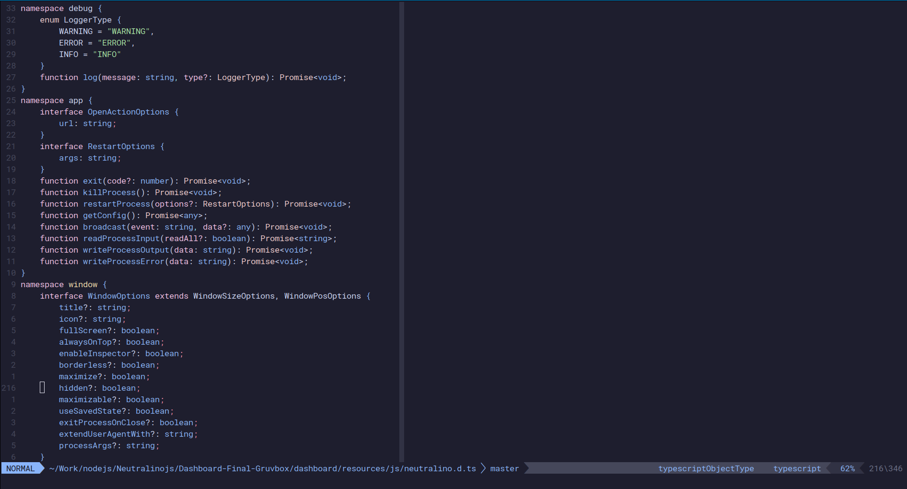

<div dir="rtl"><h1 id="colo"> فعال کردن تم‌ها در ویم</h1></div>

-   **`:colorscheme [colorscheme_name] `** -- تغییر تم رنگی
-   **`:colorscheme [space]+Ctrl+d`** -- لیست کردن تمام تم های رنگی موجود

<div dir="rtl"><h5>چند تم پیش‌فرض زیبا:</h5></div>

- retrobox
- lunaperche
- elflord
- slate

<div dir="rtl">با استفاده از دستور زیر نیز می‌توان رنگ زمینه پیش‌فرض ویم را به روشن یا تاریک تغییر داد:</div>
<br>

```
:set background=dark
:set background=light
```
<div dir="rtl">برای استفاده بهتر  از رنگ ها و همچنین فعال سازی سینتکس، از دستور زیر استفاده می کنیم:</div>
<br>

```
:syntax on
```
<div dir="rtl">برای یادگیری ذخیره‌سازی تنظیمات ویم، به فصل ۱۶ مراجعه کنید.
<br>
همچنین برای دیدن تمام تم‌های رنگی ویم به سایت زیر مراجعه کنید:
</div>

🔗 [Vim Colorschemes](https://tilde.club/~woland/vim-colorschemes/)

<div dir="rtl">برای درست دیده شدن رنگ ها در ترمینال، لازم است تا تنظیماتی را انجام دهید.
<br> 
<br> 
ابتدا متغیر زیر را در فایل بش آر سی خود قرار دهید:
</div>

```sh
export TERM=xterm-256color
```
<br> 

<div dir="rtl">سپس در تنظیمات ویم‌آرسی خود، تم ویم را به شکل زیر معین کنید:</div>

```vim
set background=dark
" Inspect $TERM instead of t_Co
if &term =~ '256color'
	" Enable true (24-bit) colors instead of (8-bit) 256 colors.
	if has('termguicolors')
		let &t_8f = "\<Esc>[38;2;%lu;%lu;%lum"
		let &t_8b = "\<Esc>[48;2;%lu;%lu;%lum"
		set termguicolors
		set mouse=a
		colorscheme catppuccin_mocha
	endif
endif

" Settings for GVim
if has('gui_running')
	set mouse=a
	set guicursor+=a:blinkon0
	set guifont=Fira\ Code\ 12
	colorscheme catppuccin_mocha
endif
```
<div dir="rtl">در بلاک کد بالا، نام تم مورد نظر شما روبه‌روی عبارت <code>colorscheme</code> قرار خواهد گرفت.
<br> 
همچنین دقت کنید که اگر از تم روشن استفاده می‌کنید، مقدار خط اول را از dark به light تغییر دهید.
<br> 
بلاک دوم مختص تنظیمات GVim است. در این بلاک فونت Fira Code نیز برای GVim معین شده است.
</div>
<br>
<div dir="rtl"><h1>تصاویر</h1>
<h3> تم زیبای catppuccin_mocha در xterm</h3></div>



<div dir="rtl"><h3> تم زیبای catppuccin_mocha در KDE Konsole</h3></div>


<div dir="rtl"><h3> تم زیبای catppuccin_mocha در GVim</h3></div>


<div style="color:yellow;" dir="rtl">همان‌طور که مشاهده می‌کنید، با استفاده از تنظیمات درست و ترمینالی توانمند، تفاوت رنگی بین ترمینال و محیط گرافیکی مشاهده نمی‌شود.
</div>


<div dir="rtl"><h3>تم Mitra ساخته‌ی نگارنده، براساس پالت رنگ ایرانی در ترمینال XFCE</h3></div>


🔗 [Mitra](https://github.com/wolandark/Mitra-Vim)

<div dir="rtl"><h3>تم روشن Gruvbox Light</h3></div>


<div dir="rtl"><h3>تم Fahrenheit</h3></div>


