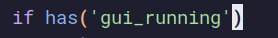
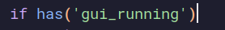
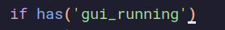

<div dir="rtl"><h1> تغییر شکل نشانگر در مودهای مختلف</h1>
ما می‌توانیم براساس مود فعلی ویم، شکل نشانگر خود را تغییر دهیم. 
برای این‌ منظور لازم است که تنظیمات زیر را در ویم‌آرسی قرار دهیم.
</div><br> 

```
let &t_SI = "\<Esc>[6 q"
let &t_SR = "\<Esc>[4 q"
let &t_EI = "\<Esc>[2 q"
```

<div dir="rtl">حالا نشانگر ما در حالت اینسرت به شکل خط صاف |، در خالت نرمال به شکل بلاک مستطیلی و در حالت جایگزینی replace mode به شکل ـ خواهد بود.</div>

<br> 
<br> 
<br> 
